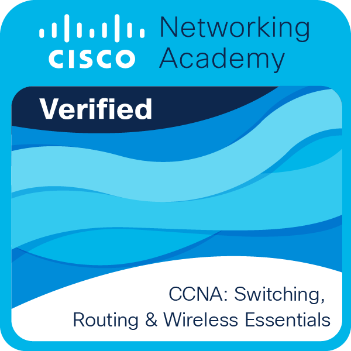
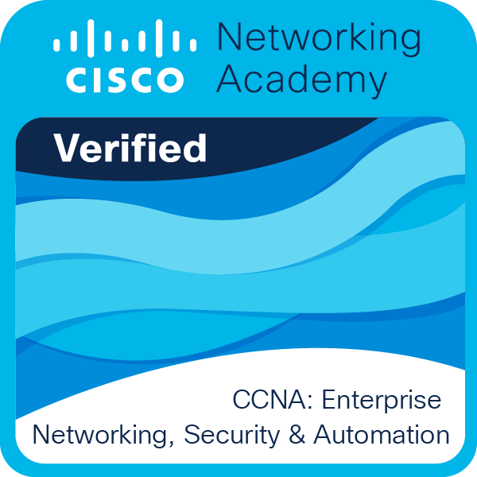
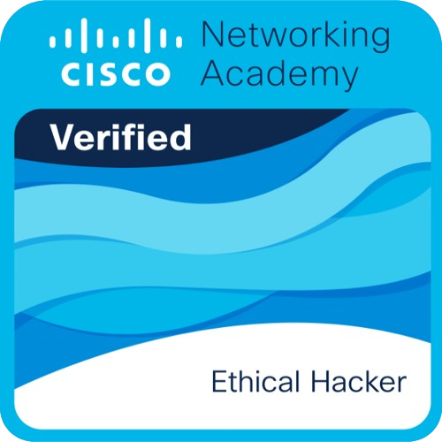

<h1 align="center">
  
</h1>

  
  
  

  

---

### 🛠️ Fachkenntnisse & Labor-Erfahrung
Mein Schwerpunkt liegt auf dem Herzschlag der IT: stabilen und sicheren Netzwerken.

- **Netzwerktechnik:** Konfiguration von Cisco-Komponenten, VLAN-Segmentierung, Routing (Static, OSPF), ACLs und Port Security.
- **IT-Sicherheit:** Grundlagen des Ethical Hacking, Firewall-Regelwerke und Netzwerkanalyse.
- **Server & Dienste:** Administration von DNS, DHCP und Active Directory sowie grundlegende Linux-Kenntnisse.
- **Virtualisierung:** Aufbau komplexer Topologien in Cisco Packet Tracer sowie Administration von VMs (VMware/VirtualBox).

---

<h2 align="center">📜 Zertifikate & Kurse</h2>

  <table border="0">
    <tr>
      <td align="center" width="120">
        <a href="https://www.credly.com/badges/9f16f964-eddd-4014-92c0-7c322e56db9d">
           
          CCNA-1
        </a>
      </td>
      <td align="center" width="120">
        <a href="https://www.credly.com/badges/c98c6c1e-57a1-40b2-80cb-1a72561dbdbc">
           
          CCNA-2
        </a>
      </td>
      <td align="center" width="120">
        <a href="https://www.credly.com/badges/7fdfd8f3-3754-4d51-a572-c5a4656a3a68">
           
          CCNA-3
        </a>
      </td>
      <td align="center" width="120">
        <a href="https://www.credly.com/badges/0fd43bd0-7518-45a4-8552-eeed9c8b409b">
           
          LPI Linux
        </a>
      </td>
    </tr>
    <tr>
      <td align="center" width="120">
        <a href="https://www.netacad.com/courses/ethical-hacker?courseLang=en-US">
           
          Ethical Hacker 
          
        </a>
      </td>
      <td align="center" width="120">
        <a href="https://coursera.org/share/797d1b3f9802ee086d807e5a5cd8b9f1">
           
          Python Basics
        </a>
      </td>
      <td align="center" width="120">
        <a href="https://www.credly.com/badges/1804cdbc-fed1-4008-befc-16fa9487ba8d">
           
          NIS2 Lead Imp.
        </a>
      </td>
    </tr>
  </table>

---

<h2 align="center">👨‍💻 Ausgewählte Projekte</h2>

  <table border="0">
    <tr>
      <td align="center">
        <a href="https://github.com/tafirnat/exam-app">
           
        </a>
        
        
         
        🌐 <a href="https://tafirnat.github.io/exam-app/">Live Demo</a>
      </td>
      <td align="center">
        <a href="https://github.com/tafirnat/Port-Quiz">
           
        </a>
        
        
         
        🌐 <a href="https://tafirnat.github.io/Port-Quiz/">Live Demo</a>
      </td>
    </tr>
    <tr><td height="20"></td></tr>
    <tr>
      <td align="center">
        <a href="https://github.com/tafirnat/efficiency-calculator">
           
        </a>
        
        
         
        🌐 <a href="https://tafirnat.github.io/efficiency-calculator/">Live Demo</a>
      </td>
      <td align="center">
        <a href="https://github.com/tafirnat/Daten-bertragung">
           
        </a>
        
        
         
        🌐 <a href="https://tafirnat.github.io/Daten-bertragung/">Live Demo</a>
      </td>
    </tr>
    <tr><td height="20"></td></tr>
    <tr>
      <td align="center" colspan="2">
        <a href="https://github.com/tafirnat/chrome-extension">
           
        </a>
        
        
      </td>
    </tr>
  </table>

---

<h2 align="center">🧩 Chrome Extensions</h2>

  <table border="0">
    <tr>
      <td align="center" colspan="2">
        <a href="https://chromewebstore.google.com/detail/quickmarks/hancgampfoojdffiebepnihadoeapjdl">
           
          <b>QuickMarks</b>
        </a>
      </td>
    </tr>
    <tr><td height="20"></td></tr>
    <tr>
      <td align="center" width="200">
        <a href="https://chromewebstore.google.com/detail/big-clock-hour/afmfkmlbijkfckclohpfdboeccobfnij">
           
          <b>Big Clock | Hour</b>
        </a>
      </td>
      <td align="center" width="200">
        <a href="https://chromewebstore.google.com/detail/big-clock-minute/cpgehceoalhakjceioddjajneophlfko">
           
          <b>Big Clock | Minute</b>
        </a>
      </td>
    </tr>
  </table>

---

  

