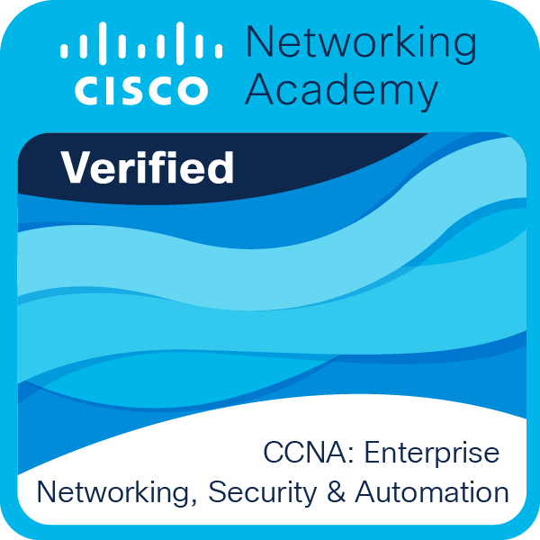
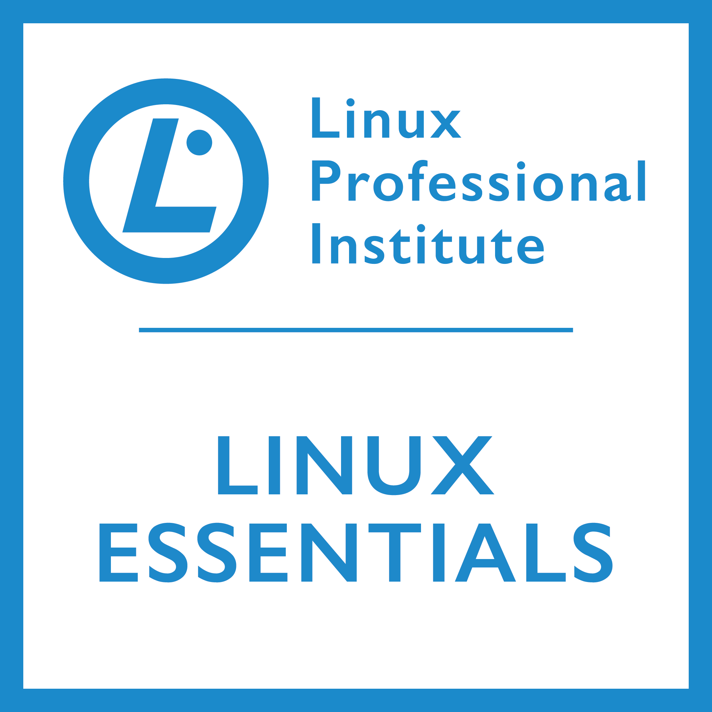
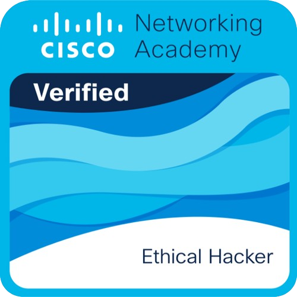

<h1 align="center">
  
</h1>

  
  
  

  

---

### 🛠️ Fachkenntnisse & Systemarchitektur
Mein Schwerpunkt liegt auf dem Herzschlag der IT: stabilen, segmentierten Netzwerken, Virtualisierung und sicherer Infrastruktur.

- **Netzwerktechnik & Routing:** MikroTik RouterOS v7, Cisco-Komponenten, VLAN-Segmentierung (Trunking/ACLs), Inter-VLAN Routing, Static & OSPF Routing.
- **Virtualisierung & Server:** Proxmox VE Administration, Storage-Tiering (NVMe/USB-C/MicroSD), eigenständige LXC-Container und Docker-Architektur.
- **Windows Server & AD:** Active Directory (AD DS), Group Policy Objects (GPO), Windows Admin Center, Berechtigungsstruktur nach **IGDLA**, NIC-Teaming, Storage Spaces und iSCSI.
- **IT-Sicherheit & Fernzugriff:** VPN-Zugang ohne offene Ports (Tailscale Subnet Router), Cloudflare Tunnel, Grundlagen des Ethical Hacking und Firewall-Regelwerke.

---

<h2 align="center">📜 Zertifikate & Kurse</h2>

  <table border="0">
    <tr>
      <td align="center" width="120">
        <a href="https://www.credly.com/badges/9f16f964-eddd-4014-92c0-7c322e56db9d">
           
          CCNA-1
        </a>
      </td>
      <td align="center" width="120">
        <a href="https://www.credly.com/badges/c98c6c1e-57a1-40b2-80cb-1a72561dbdbc">
           
          CCNA-2
        </a>
      </td>
      <td align="center" width="120">
        <a href="https://www.credly.com/badges/7fdfd8f3-3754-4d51-a572-c5a4656a3a68">
           
          CCNA-3
        </a>
      </td>
      <td align="center" width="120">
        <a href="https://www.credly.com/badges/0fd43bd0-7518-45a4-8552-eeed9c8b409b">
           
          LPI Linux
        </a>
      </td>
    </tr>
    <tr>
      <td align="center" width="120">
        <a href="https://www.credly.com/badges/94058481-c667-4db9-bf61-4302e1893943">
           
          Ethical Hacker 
        </a>
      </td>
      <td align="center" width="120">
        <a href="https://coursera.org/share/797d1b3f9802ee086d807e5a5cd8b9f1">
           
          Python Basics
        </a>
      </td>
      <td align="center" width="120">
        <a href="https://www.credly.com/badges/1804cdbc-fed1-4008-befc-16fa9487ba8d">
           
          NIS2 Lead Imp.
        </a>
      </td>
    </tr>
  </table>

---

<h2 align="center">👨‍💻 Ausgewählte Projekte</h2>

<!-- Flagship System Project -->

  <table width="100%">
    <tr>
      <td style="padding: 15px; border: 1px solid #51ffb1; border-radius: 8px;">
        <h3 align="left">🖥️ <a href="https://github.com/tafirnat/windows-server-lab">windows-server-lab</a></h3>
        
<b>Windows-Server-Labor auf Proxmox VE — Dokumentation in acht Kapiteln</b> 
        Benutzerverwaltung, Datenträgerverwaltung und RAID, Storage Spaces, Windows Admin Center, NIC-Teaming und Failover, iSCSI-Zielserver mit Initiator sowie IIS und DNS. Jedes Kapitel beschreibt nicht nur die Schritte, sondern die Begründung dahinter, und schliesst mit Verifikation über echte Befehlsausgaben und einer Fehlersuche-Tabelle ab.

        

          
          
          
          
          
        

      </td>
    </tr>
  </table>

   

  <!-- App & Tool Projects Grid -->
  <table width="100%">
    <tr>
      <td width="50%" valign="top" style="padding: 10px;">
        <h4 align="left">📝 <a href="https://github.com/tafirnat/exam-app">exam-app</a></h4>
        
Interaktive Prüfungsvorbereitungs-App für FISI & IT-Zertifizierungen.

        

          
          
        

      </td>
      <td width="50%" valign="top" style="padding: 10px;">
        <h4 align="left">🔌 <a href="https://github.com/tafirnat/Port-Quiz">Port-Quiz</a></h4>
        
Lern-Quiz für bekannte Netzwerk-Ports & Protokolle (CCNA / FISI).

        

          
          
        

      </td>
    </tr>
    <tr>
      <td width="50%" valign="top" style="padding: 10px;">
        <h4 align="left">⚡ <a href="https://github.com/tafirnat/efficiency-calculator">efficiency-calculator</a></h4>
        
Berechnungstool für Netzwerkeffizienz & Datendurchsatz.

        

          
          
        

      </td>
      <td width="50%" valign="top" style="padding: 10px;">
        <h4 align="left">📊 <a href="https://github.com/tafirnat/Daten-bertragung">Daten-Übertragung</a></h4>
        
Rechner für Datenübertragungsraten und Bandbreiten-Analysen.

        

          
          
        

      </td>
    </tr>
  </table>

---

<h2 align="center">🧩 Chrome Extensions</h2>

  <table border="0">
    <tr>
      <td align="center" colspan="2">
        <a href="https://chromewebstore.google.com/detail/quickmarks/hancgampfoojdffiebepnihadoeapjdl">
           
          <b>QuickMarks</b>
        </a>
      </td>
    </tr>
    <tr><td height="20"></td></tr>
    <tr>
      <td align="center" width="200">
        <a href="https://chromewebstore.google.com/detail/big-clock-hour/afmfkmlbijkfckclohpfdboeccobfnij">
           
          <b>Big Clock | Hour</b>
        </a>
      </td>
      <td align="center" width="200">
        <a href="https://chromewebstore.google.com/detail/big-clock-minute/cpgehceoalhakjceioddjajneophlfko">
           
          <b>Big Clock | Minute</b>
        </a>
      </td>
    </tr>
  </table>

---

<h2 align="center">📫 Kontakt & Vernetzung</h2>

  
  
  

  Systemintegration • Netzwerksegmentierung • Proxmox • Active Directory

